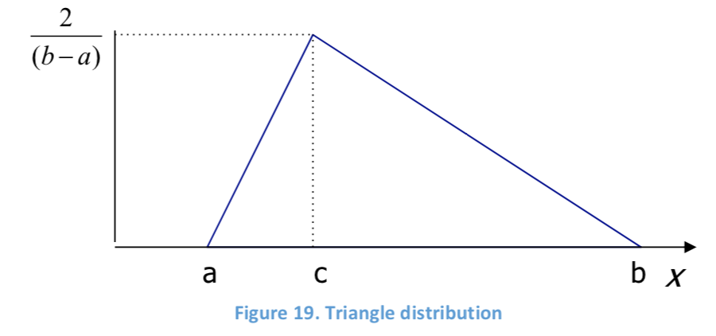

# SC0x - Supply Chain Analytics

[TOC]

## Pre-study on Key Concepts Document

### Optimization

#### Unconstrained Optimization

Global/Local extreme point

#### Constrained Optimization

1. Linear Programming
2. Integer & Mixed Integer Programming
3. Non-linear Programming
   - nonlinear function on objective function or constraints

#### Network Models

1. Shortest Path —— LP or special algorithms
2. Traveling Salesman Problem (TSP) —— hard to solve, so turn to heuristics
3. Flow Problems (Transportation & Transshipment) —— MILPs
   - multiple supply and demand nodes with fixed costs and capacities on nodes and/or arcs

#### Analysis of the Results

- Am I using all of my resources?
- Where do I have slack?
- Where I am constrained?
- How robust is my solution?

**Sensitivity Analysis:** whta happens when data values are changed

- Shadow Price or Dual Value of Constraint
- Slack Constraint
- Binding Constraint

### Estimation prior to Analysis

- Faster than more exact or precise methods
- Uses minimal amounts of data
- Can determine if more analysis is needed: Goldilocks Principle: Too big, Too little, Just right

### Distributions and Probability

#### Summary Statistics

**Central Tendency:**

- Mode
- Median
- Mean

**Dispersion or Spread:**

- Range
- Inner Quantles
- Variance & Standard Deviation
- Coefficient of Variation
  - $0\le CV \le 0.75$, low variability
  - $0.75\le CV \le 1.33$, moderate variability
  - $CV \ge 1.33$, high variability

#### Probability  Distribution

**Discrete Distribution**

- Discrete uniform distribution
  - probability is $1/N$
- Poisson distribution: $\lambda = mean=variance$
  - for modeling arrivals, slow moving inventory

**Continuous Distribution**

- Continuous uniform distribution
- Normal distribution
- Standard normal distribution
  - for setting safety stock in inventory theory
- Triangle distribution
  - for anecdotal or unknown distribution
  - 

#### Statistical Testing

**Central Limit Theorem** —— discribing the mean of sample distribution, from independent random variable with any distribution

**Confidence Interval**

