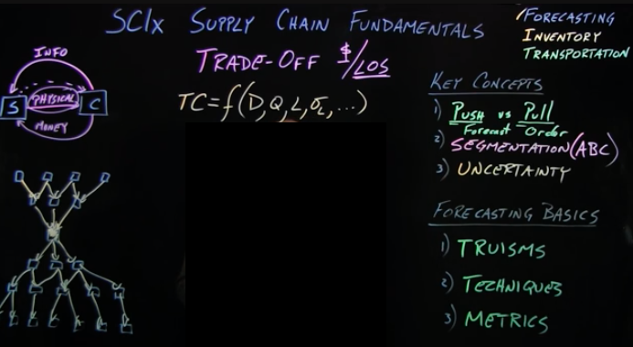

# SC1x - Supply Chain Fundamentals

[TOC]

## Week 0: Course Overview & Logistics

## Week 1: Segmentation and Introduction to Forecasting

**Target:** build up total cost (TC) function step by step, by understanding

1. Push and Pull systems

2. segementation (ABC)

3. Uncentainty

  which affecting the Forecasting / Inventory / Transportation of a SC system

### Lesson 1: Core Concepts & Approaches

#### Push vs. Pull Processes

> go to marginnote 3

